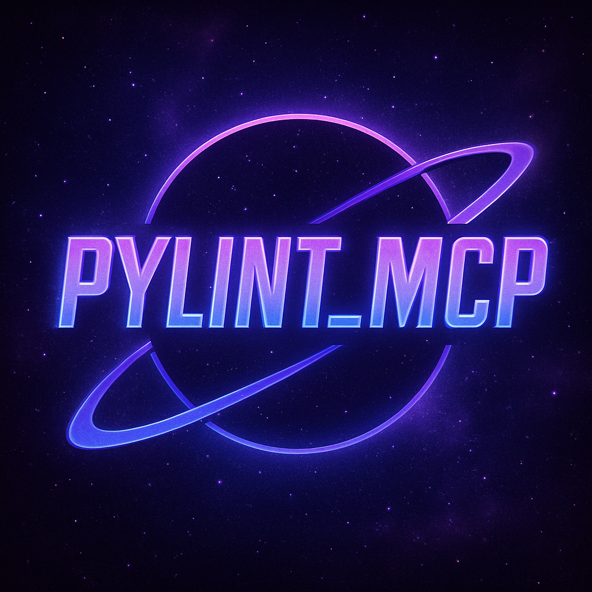

# Pylint MCP Server

A Model Context Protocol (MCP) server that provides comprehensive Python code analysis capabilities through MCP tools, including Pylint, Symilar, and Pyreverse. It runs using streamable-http, which is supported by MS Teams Apps, and other popular MCP clients such as Github Copilot.

## Overview

This project provides an MCP server specifically designed for Python code analysis using the complete Pylint universe of tools. It includes:

- **Pylint Integration**: Run Pylint analysis on Python files with customizable options
- **Symilar Analysis**: Detect code duplication and similarities across multiple files
- **Pyreverse Support**: Generate UML diagrams and dependency analysis
- **Combined Reporting**: Run comprehensive analysis with multiple tools in a single command
- **Directory Analysis**: Analyse entire directories with automatic Python file discovery
- **Modular Tool Architecture**: Tools are organised in a dedicated `tools/` directory for easy management and discovery
- **Automatic Tool Registration**: The server automatically discovers and loads all tools from the tools directory
- **FastMCP Integration**: Built using the FastMCP framework for easy development

## Features

- **Individual Tool Analysis**: Run Pylint, Symilar, or Pyreverse independently
- **Full Code Report**: Combined analysis using multiple tools on entire directories
- **Smart File Discovery**: Automatically finds all Python files in specified directories
- **Subprocess Execution**: Safe execution of analysis commands through subprocess calls
- **Auto-Discovery**: Automatically registers all Python modules in the `tools/` directory
- **Remote Repository Support**: (Planned) analyse GitHub repositories without local cloning

## Project Structure

```
src/
├── tools/              # All MCP tools go here
│   ├── pylint_tools.py # Individual Pylint universe tools
│   └── combined_reporter.py # Combined analysis reporting
├── resources/          # Static resources and data files
├── main.py            # FastAPI server entry point
├── shared_mcp_object.py # Shared MCP instance and tool registration
├── config.py          # Configuration management
└── pylint_core.py     # Core analysis execution logic with directory readers
```

## Getting Started

1. **Install Dependencies**:
   ```bash
   uv sync
   ```

2. **Run the Server**:
   ```bash
   uv run fastapi dev main.py
   ```

3. **Connect via MCP**: Configure your MCP client to connect to `http://localhost:8000/mcp`

If using Github Copilot, you can create a folder in your PROJECT ROOT DIRECTORY called .vscode, and then put an mcp.json file in there. Then, paste the following into that:
{
    "servers": {
        "PYLINT_MCP": {
            "type": "sse",
            "url": "http://localhost:8000/mcp"
        }
    }
}


## Available Tools

### `run_full_report` - **Comprehensive Analysis**

Run a complete code quality analysis combining Pylint and Symilar on entire directories.

**Parameters:**
- `path`: Directory path or single file to analyse
- `options`: Command line options (applied to both tools)

**What it does:**
- Runs **Pylint** on the entire directory for code quality analysis
- Runs **Symilar** on all Python files to detect code duplication
- Returns combined results in a single report

### `run_pylint_cmd` - **Pylint Analysis**

Run Pylint analysis on Python files with customizable options.

**Parameters:**
- `path`: The file path to analyse with Pylint
- `options`: Pylint command line options as a space-separated string

### `run_symilar_cmd` - **Code Similarity Analysis**

Run Symilar to detect duplicate code and similarities between files.

**Parameters:**
- `path`: Directory or file path to analyse for similarities
- `options`: Symilar command line options

### `run_pyreverse_cmd` - **UML and Dependency Analysis**

Run Pyreverse to generate UML diagrams and analyse code dependencies.

**Parameters:**
- `path`: The file path to analyse with Pyreverse
- `options`: Pyreverse command line options

## Tool Features

### Smart Directory Handling
- **Automatic File Discovery**: Tools automatically find all `.py` files in specified directories
- **Recursive Analysis**: analyses subdirectories automatically
- **Single File Support**: All tools work with individual files or entire directories

### Combined Analysis Benefits
- **Unified Reporting**: Get code quality and duplication analysis in one command
- **Efficient Processing**: Optimized to run multiple tools without redundant file scanning
- **Comprehensive Coverage**: Pylint for quality, Symilar for duplication detection

## Adding New Tools

To add a new tool:

1. Create a new Python file in the `tools/` directory
2. Import the shared MCP object: `from shared_mcp_object import mcp`
3. Use the `@mcp.tool()` decorator to register your function
4. The tool will be automatically discovered and registered when the server starts

## Command Options

### Pylint Options
- `--disable=C0114`: Disable missing module docstring warnings
- `--max-line-length=100`: Set maximum line length
- `--output-format=json`: Output results in JSON format
- `--enable=all --score=no`: Enable all checks without scoring

### Symilar Options
- `-d 4`: Set minimum duplicate lines threshold
- `-i`: Ignore comments in similarity analysis
- `--ignore-docstrings`: Exclude docstrings from analysis
- `--ignore-imports`: Exclude import statements

### Pyreverse Options
- `-o png`: Output format (png, svg, etc.)
- `-A`: Generate all diagrams
- `-S`: Generate only class diagrams

Always prefix options with `--` (double dash) and use `=` for options that take values.

## Roadmap

- ✅ **Individual tool support** (Pylint, Symilar, Pyreverse)
- ✅ **Combined reporting** with full directory analysis
- ✅ **Smart file discovery** and directory handling
- ✅ **Extra-descriptive docstrings to leverage the power of the MCP client language models**
- 🔄 **Remote repository analysis** (GitHub, GitLab) without local cloning
- 🔄 **Enhanced reporting formats** (HTML, JSON, XML)
- 🔄 **Configuration file support** for tool defaults

This MCP server provides a comprehensive solution for Python code analysis, combining multiple tools into a unified interface accessible through the Model Context Protocol.